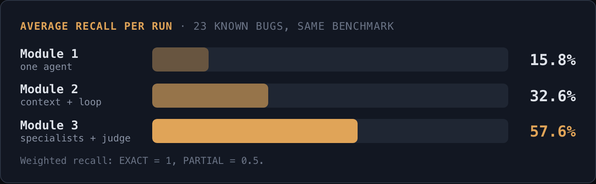
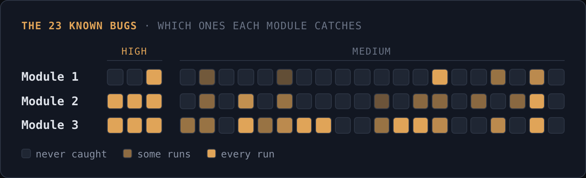

# Give Your AI Agent Specialists: Closing the Coverage Gap

Module 2 gave our agent context and a loop. It got a lot better - but it's still one agent looking at everything through one lens.

And one agent is unsystematic. It catches whatever grabs its attention and moves on. Tell it to check everything and it'll still spend most of its effort on the same handful of bugs.

So in this module we add specialists. Five agents, each focused on one type of bug, running in parallel next to the general hunter we already have.

More agents means more findings - some of them the same bug described five different ways, some just plain wrong. So we also add the course's first judge, to triage all of it into one list.

The climb we're doing today:

```
Module 1                Hunter Agent -> Findings
Module 2   Context ->   Hunter Agent (looped) -> Findings
Module 3   Context ->   Specialists + Hunter (looped) -> Judge -> Findings
```

Get the code - `git fetch --tags && git checkout module-3` in your existing clone (starting fresh? clone first, see Module 1's Step 0).

Module 1 and Module 2's code stay untouched; Module 3 only adds `lucid/specialists.py`, `lucid/orchestrator.py`, and `lucid/judge.py`, plus a new `--specialists` flag on `lucid/run.py`.

**Steps at a glance:**

1. **Step 1** - Build five specialist lenses.
2. **Step 2** - Fan them out with the general hunter, looped.
3. **Step 3** - Triage with a judge.
4. **Step 4** - What doesn't scale yet.

---

## Step 1 - Build five specialist lenses

Five is a good number to start with.

We picked them by looking at two things: which bug types show up most often in real audits, and which ones actually appear in our benchmark's ground truth.

A specialist for a bug type that barely shows up in the benchmark is one we couldn't measure.

1. **State & Lifecycle Completeness** - multi-step entities (positions, orders, vaults) whose state breaks when one is merged or transferred into another's existing record.
2. **Trust Boundary & Permissionless Abuse** - functions reachable by the wrong caller, missing or inverted permission checks.
3. **Arithmetic & Formula Correctness** - rounding, overflow/underflow, formulas that don't match their intended math.
4. **Temporal State & Staleness** - values that should be locked in at one point in time but silently pick up a later value instead.
5. **Edge Case & Boundary** - degenerate inputs, off-by-one conditions, boundary values.

Every specialist uses the same base we built in Modules 1 and 2 - same severity ladder, same evidence rules, same JSON output, same protocol context.

The only thing that changes is the "what to look for" section. That also keeps the output consistent, so the judge can compare findings across specialists.

One rule if you build your own specialists: write the "what to look for" section in generic language.

Don't describe the benchmark's bugs - describe the type of bug. If you write the prompt knowing the answers, you're overfitting to the benchmark, and it doesn't transfer on the next codebase.

Here's the State & Lifecycle specialist: its system prompt, and the "what to look for" section that makes it a specialist.

The rest of its prompt is the shared base. The other four are in the repo - same structure, different focus.

<details>
<summary>Show the State & Lifecycle Completeness specialist, exactly as it ships in the repo</summary>

```python
STATE_LIFECYCLE_SYSTEM_PROMPT = """\
You are a senior smart-contract security auditor specializing in state and \
lifecycle bugs — multi-step entities (positions, orders, vaults, epochs, \
listings) whose creation, transition, and destruction paths fail to keep all \
of their coupled state in sync.

Two rules you never break:
1. You output ONLY a single JSON object. No prose, no markdown, no code fences \
around it.
2. You never report a bug you cannot back with evidence: an exact location, the \
specific flawed logic, and concrete steps to trigger it.
"""
```

```
# What to look for
This pass has one job: find state-and-lifecycle bugs. Other passes cover \
other bug classes — do not spend effort chasing them here. Within this class, \
be exhaustive.

For every entity that has more than one step or stage in its life — a \
position, an order, a listing, a vault, an epoch, a vesting schedule — trace \
every code path that can create, mutate, or remove it, and check each path \
against every OTHER piece of state that entity's lifecycle is coupled to. \
Spend the most effort on the first pattern below — it is the highest-yield \
one — before moving on to the rest:
- **Merge, transfer, or consolidation operations first.** When one entity's \
data is folded, transferred, or merged into another entity's EXISTING \
record (a position moved to a new owner, a sub-account consolidated into a \
parent, an item transferred between containers), trace every per-entity \
progress counter, checkpoint, or accumulated-amount field involved. Does the \
receiving entity inherit a stale counter left over from what the record \
already tracked, instead of the correct value for what's actually being \
merged in? Does the giving entity's own progress silently vanish because the \
operation only ever writes to the receiving side's record? Two entities that \
are supposed to track independent progress ending up reading from one \
shared field, because a transfer/merge path was written for the "create a \
brand-new record" case and never updated for the "fold into an existing \
one" case, is the single most common bug in this class — look here first \
and hardest.
- Alternate or emergency paths (cancel, force-close, admin override, pause/\
resume) that skip a checkpoint or bookkeeping update the "normal" path \
performs — does every exit door update the same state the front door does?
- Creation paths that copy, reuse, or default from a shared or stale source \
(a struct copied from another entity, a global counter or template reused \
across instances) — can two entities end up aliasing the same storage or \
sharing a flag that should be independent per-entity?
- Destruction or removal paths that clear an entity's own record but leave \
orphaned references elsewhere — an index not decremented, an array entry not \
removed or swapped-and-popped correctly, a mapping entry left pointing at a \
now-invalid id.
- Symmetric operations that should mirror each other but don't — e.g. the \
"open"/"deposit" side of a lifecycle updates two variables together, but the \
"close"/"withdraw" side only updates one of them.
- Re-entering a lifecycle stage that was meant to be one-shot (re-initializing \
an already-initialized entity, re-triggering a completion step) because \
nothing marks the stage as already consumed.
```

</details>

---

## Step 2 - Fan them out with the general hunter, looped

All 5 specialists and Module 2's general hunter run at the same time.

So adding the specialists doesn't make a run take longer: you wait for the slowest lane, not the sum of all six.

Each lane also loops, the same way Module 2's `find_bugs_loop` did. From round two on, a lane gets the list of what it already found and is told to look somewhere else:

```
# Already found - do not repeat these
Earlier passes over this same codebase already reported the findings below.
Do not report any of them again, even rephrased or with a different title. Look
at contracts, functions, and guarantees not yet covered by this list.

{already_found}
```

One thing to note: a lane's loop only excludes its own prior rounds.

The State & Lifecycle lane doesn't know what the Arithmetic lane found - you can also test if you'll get better results if they see all of the found bugs so far.

The numbers, measured at 10 rounds per lane: a full run is 62 LLM calls total - 1 context build, 6 lanes x 10 rounds, 1 judge call - around 2.7 million tokens and about 35 minutes wall-clock.

Measured cost: **~$1.30 per run**.

Try it yourself: `python -m lucid.run --specialists` runs the whole thing - build context, fan out, loop, judge, print.

---

## Step 3 - Triage with a judge

Since adding more hunters and specialists, we get more raw findings. That's why we need a judge pass so we don't drown ourselves in findings.

The judge gets all findings from the 6 lanes, grouped by which lane reported what. It does four things:

1. Merges findings from different lanes that describe the same bug, even if they're worded completely differently.
2. Keeps findings separate when they touch the same function but are actually different bugs.
3. Assigns the final severity, using the same CRITICAL/HIGH/MEDIUM ladder as every prompt in the course.
4. Checks every finding against the code it points to, and drops anything the code contradicts or that doesn't have enough evidence - no matter how confident the specialist was.

Here are the results we got for 2 runs.

| Sequence | Findings (judged) | Weighted recall |
|---|:---:|:---:|
| 1 | 40 | 58.7% (13.5/23) |
| 2 | 45 | 56.5% (13/23) |

Raw findings for both runs: [`m3-run-1.json`](https://github.com/asendz/ai-web3-security-course/blob/master/target/runs/m3-run-1.json) and [`m3-run-2.json`](https://github.com/asendz/ai-web3-security-course/blob/master/target/runs/m3-run-2.json).

Average **57.6%**.

High recall was 3/3 in both runs - the same as Module 2's loop already got.

So the whole gain comes from Medium-severity bugs. That's where one agent kept missing things, and that's what the specialists fixed.



Here's how each specialist did on its own - scored on its own raw output, before the judge, only against the bugs it was built to target:

| Specialist | Own target subset | Hit rate |
|---|---|---|
| State & Lifecycle | H-01, H-02, H-03, M-03, M-13, M-18, M-20 (7 items) | 57.1%, stable both runs |
| Arithmetic & Formula | M-02, M-06, M-14, M-17 (4 items) | 100% and 75% across the two runs |
| Temporal State & Staleness | M-07, M-08, M-11 (3 items) | 66.7%, stable both runs |
| Edge Case & Boundary | M-05, M-16, M-19 (3 items) | 66.7%, stable both runs |
| Trust Boundary | M-09, M-10, M-12, M-15 (4 items) | 0% and 25% across the two runs |

State & Lifecycle is the important one. It catches H-01 and H-02 as EXACT in both runs - the cross-contract bug Module 1 never found in 4 tries, and Module 2's single pass found in only 2 of 4.

And M-01 - the inverted check every run in Modules 1 and 2 missed - got caught as EXACT for the first time, in run 2.

---

## Step 4 - What doesn't scale yet

A few things to keep in mind if you take this further:

- **The judge is one call, judging everything at once.** Right now it gets every finding from all 6 lanes in a single prompt. That's obviously not the best approach - one LLM call triaging hundreds of findings isn't reliable, focus and context dilute. You can already see it here: in the runs above, a few bugs a specialist had found exactly got lost or diluted in reconciliation - dropped, or merged into a vaguer finding.
- **Batch it instead.** Split the findings into batches, so the judge triages up to 10 findings at a time, say - that preserves the focus and context.
- **Not every specialist belongs on every codebase.** Add more specialists over time and you'll inevitably end up with ones that aren't needed on a given target. It'll be smart to have functionality that chooses which specialists to employ per codebase - that's a job for the orchestrator.
- **More specialists means more duplicates.** Some overlap between specialists is good - it raises the odds of catching a given bug, since LLMs are non-deterministic and catching something once is no guarantee you'll catch it again next time. But overlap without reconciliation just means noisier output. You need real deduplication logic on top of what the judge already does.

We'll see whether the deduplication logic and the orchestrator-picks-specialists functionality make it into this repo's code.

This is a hands-on course - that might end up being your take-home assignment instead.

---

## What you built

Three modules ago we had one agent reading code cold. Now we have six agents hunting in parallel and a judge that checks their work against the code.



57.6% average recall - up from 32.6% in Module 2. And M-01, the "easiest" bug in the set that every single run so far missed, finally got caught.

It's not done. The judge has never been checked against a human's read of the same output, and everything was tuned on one codebase. That's what Module 4 is for.

You're three modules in.

---

## Reference

- [`lucid/specialists.py`](https://github.com/asendz/ai-web3-security-course/blob/master/lucid/specialists.py) - the five specialist lenses and the per-specialist loop runner.
- [`lucid/orchestrator.py`](https://github.com/asendz/ai-web3-security-course/blob/master/lucid/orchestrator.py) - the concurrent fan-out across all six lanes.
- [`lucid/judge.py`](https://github.com/asendz/ai-web3-security-course/blob/master/lucid/judge.py) - the reconciliation pass.
- [`target/GROUND_TRUTH.md`](https://github.com/asendz/ai-web3-security-course/blob/master/target/GROUND_TRUTH.md) - same answer key as Modules 1-2.
- [`target/runs/m3-run-1.json`](https://github.com/asendz/ai-web3-security-course/blob/master/target/runs/m3-run-1.json) through [`m3-run-2.json`](https://github.com/asendz/ai-web3-security-course/blob/master/target/runs/m3-run-2.json) - the two real measured sequences behind Step 3's numbers.

<script type="application/ld+json">
{
  "@context": "https://schema.org",
  "@graph": [
    {
      "@type": "TechArticle",
      "headline": "Give Your AI Agent Specialists: Closing the Coverage Gap in Web3 Security",
      "description": "Add five focused specialist agents and a judge to your Module 2 harness - fan them out in parallel, loop each one, and measure whether reconciling five lenses beats one.",
      "author": {"@type": "Person", "name": "Asen"},
      "datePublished": "2026-10-07",
      "dateModified": "2026-10-07"
    },
    {
      "@type": "HowTo",
      "name": "Build a specialist-agent fan-out with a judge for AI web3 security auditing",
      "step": [
        {"@type": "HowToStep", "name": "Step 1 - Build five specialist lenses", "text": "Five focused reasoning lenses, chosen by cross-referencing real audit categories against this course's own ground truth, written in fully generic language so they don't overfit to one benchmark."},
        {"@type": "HowToStep", "name": "Step 2 - Fan them out with the general hunter, looped", "text": "All 5 specialists plus the general hunter run concurrently in one ThreadPoolExecutor batch, each one looped with self-exclusion, so extra coverage costs no extra wall-clock time."},
        {"@type": "HowToStep", "name": "Step 3 - Triage with a judge", "text": "An LLM judge merges, deduplicates, re-scores, and verifies the pooled findings from all 6 lanes against the actual code. Measured: 58.7% and 56.5% weighted recall across two 10-round sequences, average 57.6%, with High recall 3/3 in both."},
        {"@type": "HowToStep", "name": "Step 4 - What doesn't scale yet", "text": "Three honest gaps in today's design: a judge that grades everything in one call and won't hold up as findings grow, no logic yet for choosing which specialists apply to a given codebase, and no deduplication beyond what the judge already does despite deliberate overlap between specialists."}
      ]
    }
  ]
}
</script>
